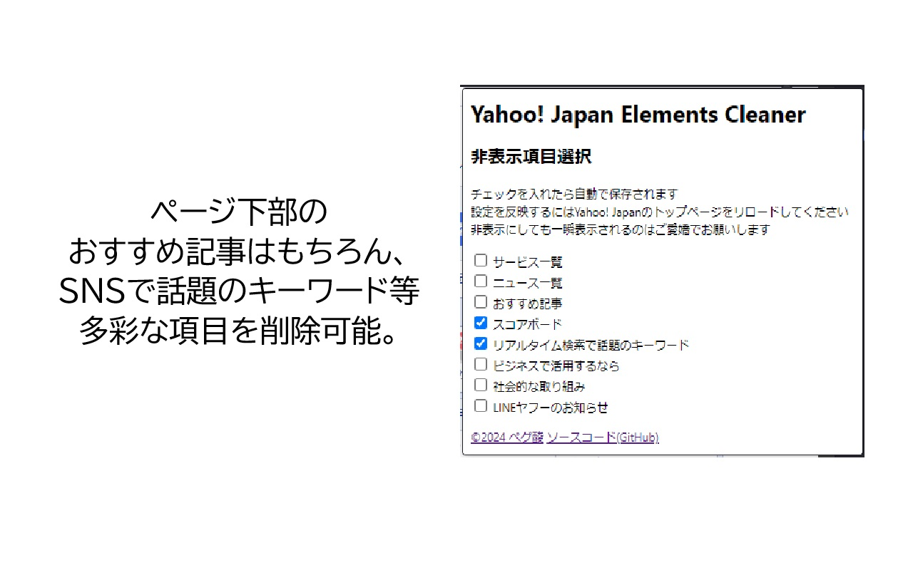

# Yahoo! Japan Elements Cleaner

## 機能説明

選択したYahoo! Japanのトップページ項目を非表示にできる、Chrome系ブラウザ用の拡張機能です。

Yahoo! Japanのトップページに表示されるニュースフィードにうんざりしていませんか？
この拡張機能を使ってそれを非表示にし、平穏な心を保って快適なインターネットライフを取り戻しましょう。

[ダウンロードはこちらから。](https://chromewebstore.google.com/detail/yahoo-japan-elements-clea/eebgdhjgpgcjamkfocchnkmfldmgkjol)

## 非表示にできる項目

現在、以下の項目の非表示に対応しています。

- サービス一覧
- ニュース一覧
- おすすめ記事
- スコアボード
- リアルタイム検索で話題のキーワード
- ビジネスで活用するなら
- 社会的な取り組み
- LINEヤフーのお知らせ

## ライセンス・サポート・プルリクエストについて

MITライセンスです。本拡張機能の使用に際し、開発者は一切責任を負いません。

不具合や機能要望などございましたら、[Chromeウェブストア内のサポートページ](https://chromewebstore.google.com/detail/eebgdhjgpgcjamkfocchnkmfldmgkjol/support)か、[GitHubのissues機能](https://github.com/mk499490/YahooJPCleaner/issues)にてご連絡ください。プルリクエストも大歓迎です。なお、必ずしもご要望にお応えできるとは限りませんのでご了承ください。

改造につきましては自由に行っていただいて構いません。公序良俗の範囲内でお願いいたします。
